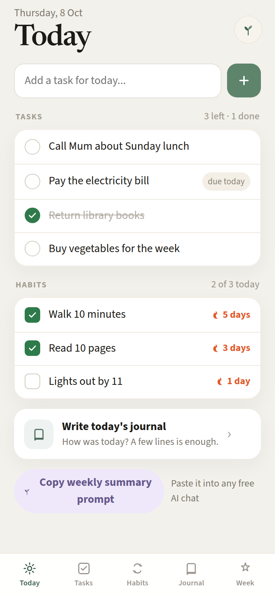

# Life OS

Life OS is a calm, free, open-source home for the things that are yours: tasks, habits, a journal, and a weekly summary. It runs as a phone-first site on your own free Netlify account, and every task, tick and diary line stays in your own copy of the Life OS Notion template. Nothing is sent to a paid AI. When you want a reflection, you copy a prompt and paste it into whatever free chat you already use.



## Set up

You need a free Notion account, a free GitHub account, and a free Netlify account. No coding.

### 1. Duplicate the template and connect an integration

Open the [Life OS template](https://sun-football-e11.notion.site/Life-OS-3f14520002e381119e61d47db1f52361) and tap **Duplicate**. Then create an internal integration at [notion.so/profile/integrations](https://www.notion.so/profile/integrations), copy its token, and on your duplicated Life OS page choose **••• → Connections** and pick that integration.

### 2. Fork this repo on GitHub

Fork [github.com/saumyansh95/lifeos](https://github.com/saumyansh95/lifeos). Use **Fork**, not “Use this template”, so later updates are one tap.

### 3. Import the fork into Netlify

In Netlify choose **Add new site**, then **Import from Git**, and pick your fork. The build settings are already in `netlify.toml`. Leave them as they are.

### 4. Add the two environment variables

On that same screen add:

- `NOTION_TOKEN` — the internal integration token from step 1
- `APP_PASSWORD` — any password you want to type when you open the site

### 5. Deploy and check the ticks

Deploy, open the site, sign in, and confirm the four ticks: Tasks, Habits, Journal and Weekly Summary.

### 6. Add it to your home screen

On iPhone: Share → **Add to Home Screen**. On Android: the browser menu → **Install app** or **Add to Home screen**. It then opens like an app.

The same steps are written out in [docs/setup.md](docs/setup.md), including what to do when a tick stays missing.

## Updating

Life OS checks once a day for a newer `vX.Y.Z` [GitHub Release](https://github.com/saumyansh95/lifeos/releases) of `saumyansh95/lifeos`. If you are offline, or there is no release yet, nothing is shown.

When a newer version exists, the app shows a banner. To take the update, open your fork on GitHub, click **Sync fork**, then **Update branch**. Netlify sees the new commit and rebuilds on its own. Your tasks, habits and journal live in Notion, so updating the site never touches them.

## Netlify free plan

The free plan includes **300 credits a month**, and that cap is hard. Each production deploy costs **15 credits**, which is about **20 deploys a month**. Every **Sync fork** and every environment-variable change starts a deploy and spends those credits. If the credits run out, Netlify pauses all of your sites on the free plan until next month. Day to day, Life OS itself is tiny: opening the app does not deploy anything, and there is no scheduled rebuild.

## Develop

```bash
npm install
npm test
npm run dev
```

`npm run dev` with `?mock=1` opens the screens against sample data, with no Notion token. `npm test` runs the functions against a fake Notion client. `npx netlify dev` serves the functions locally when you want the real token.

## License

MIT. Copyright Saumyansh Dhabriya.
